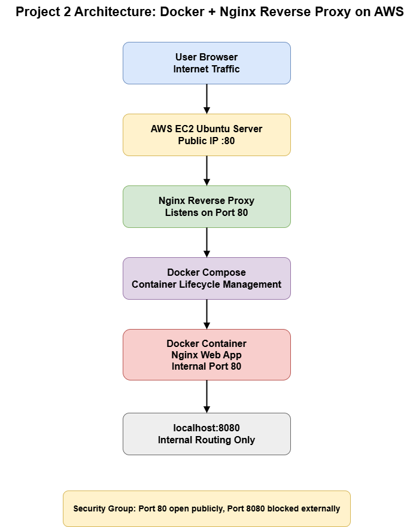
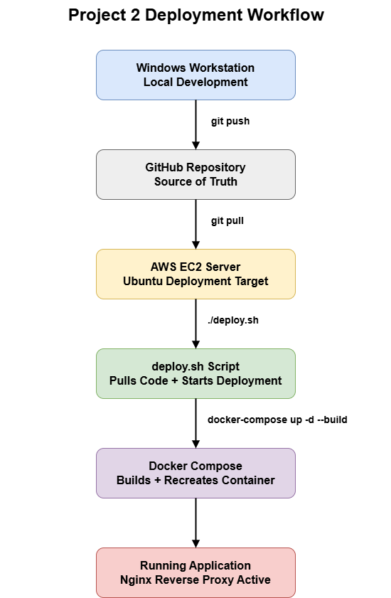
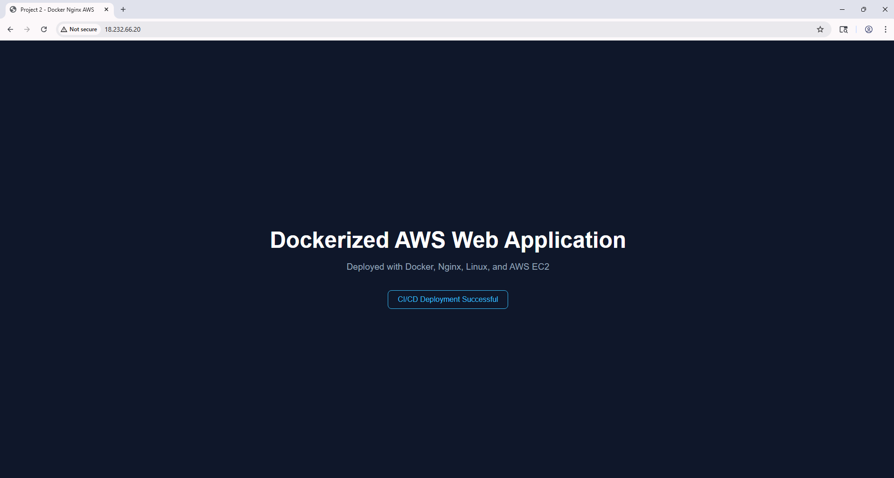
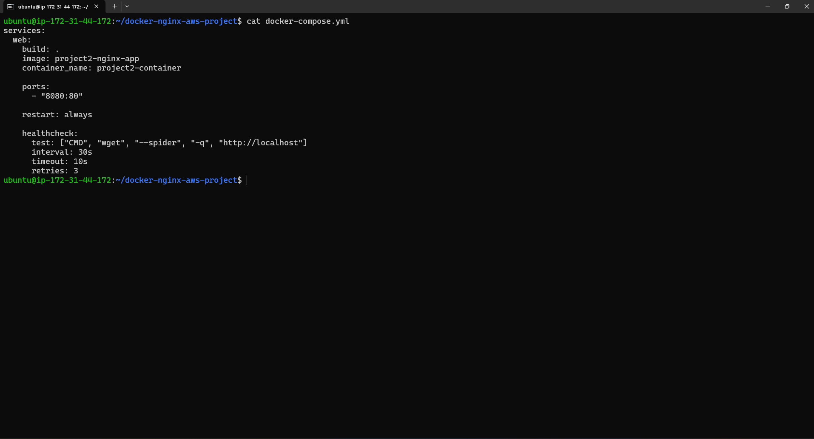
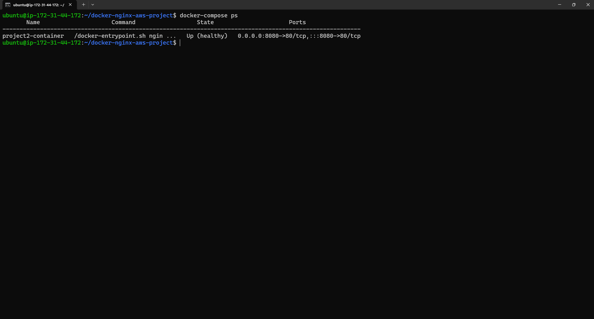
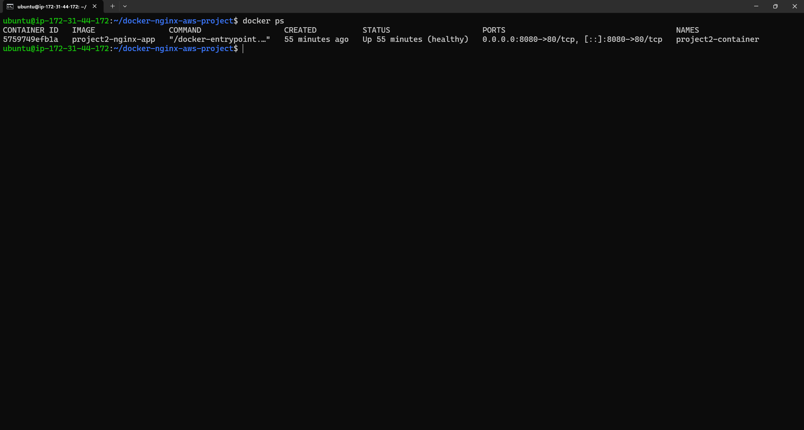
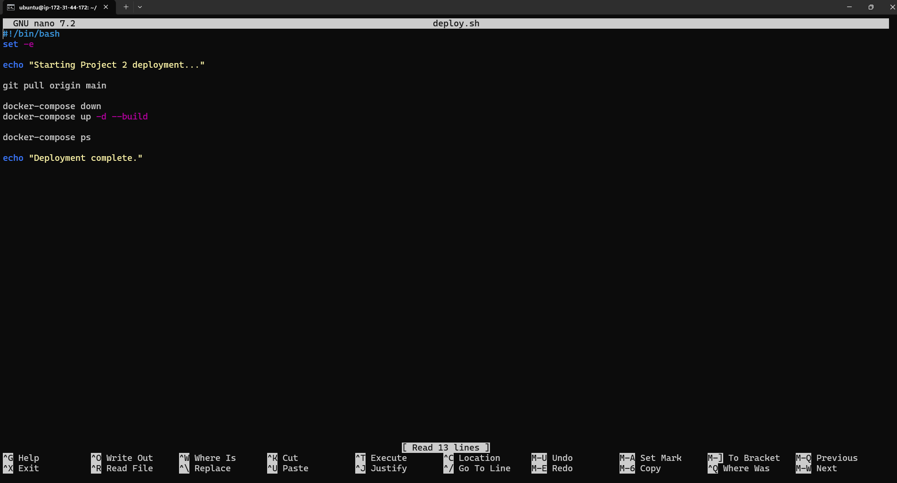
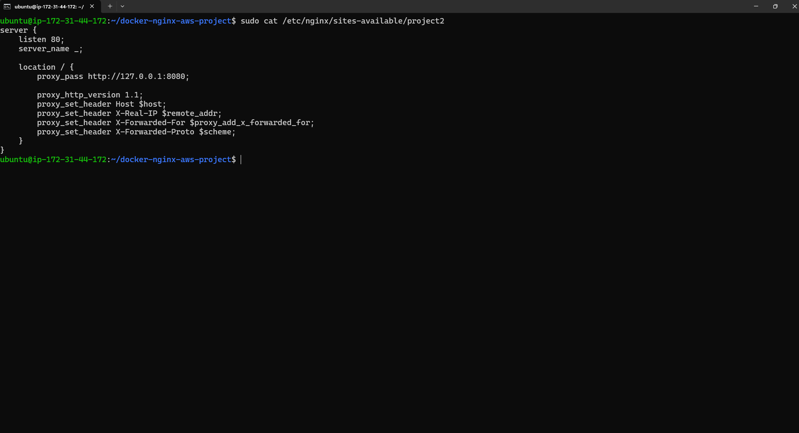
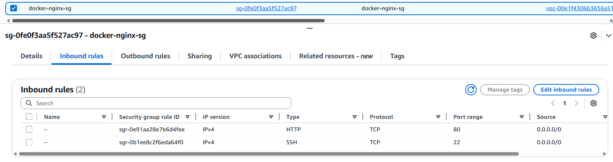

# Project 2 — Dockerized Web Application Deployment with Nginx Reverse Proxy on AWS

## Project Overview

This project demonstrates a production-inspired deployment architecture using:

- Docker
- Docker Compose
- Nginx Reverse Proxy
- AWS EC2
- Linux Server Administration

The application is containerized using Docker and deployed on an AWS EC2 Ubuntu server. Nginx is configured as a reverse proxy to securely route public HTTP traffic to the internal Docker container.

This project was designed to simulate real-world DevOps deployment practices while maintaining a clean and interview-friendly architecture.

## Architecture

  

---

## Technologies Used
Technology	    Purpose
AWS EC2	        Cloud hosting environment
Ubuntu Linux	Server operating system
Docker	        Containerization platform
Docker-Compose	Container orchestration
Nginx	        Reverse proxy and web server
Git	            Version control
GitHub	        Source control repository
Bash	        Deployment automation scripting

## Key Features

✅ Dockerized web application deployment

✅ Nginx reverse proxy configuration

✅ Secure traffic routing through port 80

✅ Container isolation behind reverse proxy

✅ Docker Compose deployment orchestration

✅ Automated deployment workflow

✅ Container health monitoring

✅ Git-based deployment workflow

✅ AWS Security Group hardening

## Infrastructure Security Improvements

One of the major security improvements implemented in this project was restricting direct access to the Docker container.

## Initial State

The container was publicly accessible through:

Port 8080
Security Improvements Implemented
Configured Nginx as the public entry point on port 80
Restricted container communication to localhost:8080
Removed public access to port 8080 from the AWS Security Group
Result

External traffic can only access the application through the reverse proxy layer.

## Nginx Reverse Proxy Configuration

Nginx was configured to listen on port 80 and forward traffic to the Docker container running internally on port 8080.

server {
    listen 80;
    server_name _;

    location / {
        proxy_pass http://127.0.0.1:8080;

        proxy_http_version 1.1;
        proxy_set_header Host $host;
        proxy_set_header X-Real-IP $remote_addr;
        proxy_set_header X-Forwarded-For $proxy_add_x_forwarded_for;
        proxy_set_header X-Forwarded-Proto $scheme;
    }
}

---

## Docker Compose Configuration

Docker Compose was used to simplify deployment orchestration and container lifecycle management.

Features Implemented
automatic container restart policies
container health checks
simplified deployment management
consistent rebuild workflow
services:
  web:
    build: .
    image: project2-nginx-app
    container_name: project2-container

    ports:
      - "8080:80"

    restart: always

    healthcheck:
      test: ["CMD", "wget", "--spider", "-q", "http://localhost"]
      interval: 30s
      timeout: 10s
      retries: 3

## Deployment Workflow

This project uses a Git-based deployment workflow.

  

## Deployment Automation Script

A deployment script was created to simplify deployments and ensure consistency.

- #!/bin/bash
- set -e

- echo "Starting Project 2 deployment..."

- git pull origin main

- docker-compose down
- docker-compose up -d --build

- docker-compose ps

echo "Deployment complete."
What This Script Does
pulls latest code changes
rebuilds Docker image
recreates containers
validates deployment status

## Health Validation

- Container health checks were implemented using Docker Compose.

- This improves deployment reliability and validates that the application inside the container is functioning properly.

- healthcheck:
  test: ["CMD", "wget", "--spider", "-q", "http://localhost"]
  interval: 30s
  timeout: 10s
  retries: 3

## Challenges and Troubleshooting

# Git Merge Conflict Resolution

A Git rebase conflict occurred during deployment workflow updates.

- Resolution Process
- identified conflicting files
- manually resolved conflicts
- completed Git rebase workflow

This strengthened understanding of:

Git workflows
source control conflict resolution
deployment synchronization
Reverse Proxy Troubleshooting

Nginx configuration validation:

sudo nginx -t

Traffic flow testing:

curl http://localhost
curl http://localhost:8080
Security Validation

After removing public access to port 8080:

✅ public access through port 80 remained functional

✅ direct access to port 8080 failed externally

This confirmed the reverse proxy architecture was functioning securely.

## Lessons Learned

This project strengthened hands-on experience in:

- Linux server administration
- Docker containerization
- Docker Compose orchestration
- reverse proxy architecture
- AWS networking and security groups
- deployment automation
- Git workflows
- infrastructure troubleshooting

## Future Improvements

Potential future enhancements:

- HTTPS with SSL/TLS certificates
- automated CI/CD pipelines
- centralized logging
- monitoring and alerting
- automated rollback workflows

---

# 📸 Infrastructure Screenshots

## 🌐 Running Application

  

---

## 🐳 Docker Compose Configuration

  

---

## 📦 Docker Compose Status

  

---

## 🚀 Docker Container Status

  

---

## 🤖 Deployment Automation Script

  

---

## 🌐 Nginx Reverse Proxy Configuration

  

---

## 🔒 AWS Security Group Configuration

  

